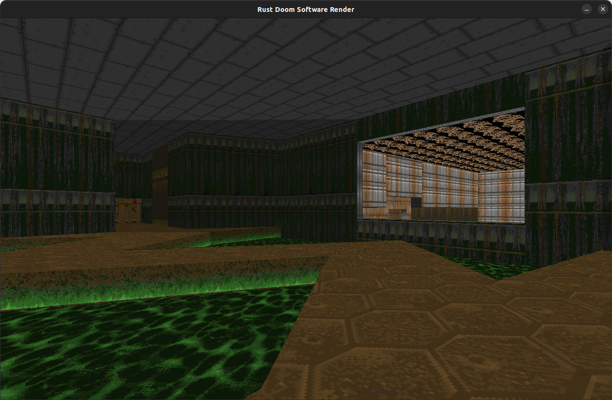

# yadoom-rs

*Yet Another Doom renderer written in safe Rust.*



> **Status:** Early‑alpha (playable). Rendering path, level loading and basic input are implemented; Sprites are WIP.

---

## 🚀 Quick start

```bash
# 1. Prerequisites
#    – Rust ≥ 1.79 (rustup.rs) –
#    – A vanilla Doom WAD (e.g. doom1.wad) –

# 2. Clone & build (release for best FPS)
$ git clone https://github.com/your‑nick/yadoom‑rs && cd yadoom‑rs
$ cargo run --release -- <path‑to‑wad> {level_num}
```
---

## 📐 Project layout

```
yadoom-rs/         Workspace root
├── docs/          Screenshots for now
└── src/
    ├── wad/       Zero‑copy WAD & lump parsing
    ├── world/     Typed BSP / geometry layer
    ├── renderer/  Software & (future) wgpu back‑ends
    └── bin/       Binary; arg‑parse, window & main‑loop

```

---

## 🛣️ Roadmap

* [x] Column & span SW renderer
* [x] Visplane clipping
* [ ] Sprites

---
