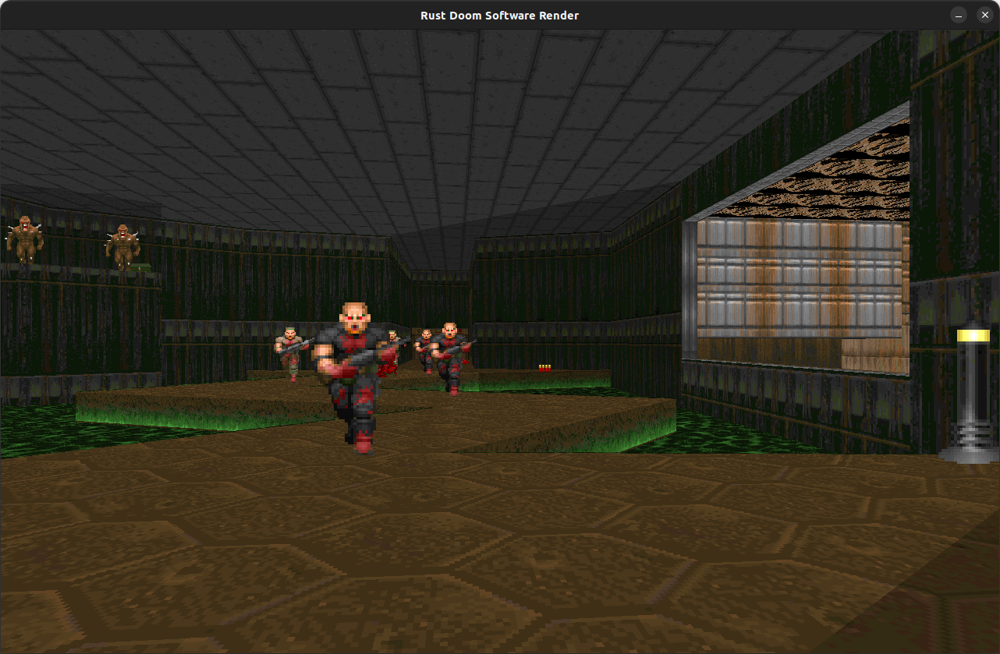

# yadoom-rs

*A Doom renderer written in safe Rust.*



> **Status:** Early‑alpha (playable). Rendering path, level loading and basic input are implemented; audio, Sprites are WIP.

---

## 🚀 Quick start

```bash
# 1. Prerequisites
#    – Rust ≥ 1.79 (rustup.rs) –
#    – A vanilla Doom WAD (e.g. doom1.wad) –

# 2. Clone & build (release for best FPS)
$ git clone https://github.com/your‑nick/yadoom‑rs && cd yadoom‑rs
$ cargo run --release -- <path‑to‑wad>/doom1.wad
```
---

## 📐 Project layout

```
yadoom-rs/         Workspace root
├── docs/          Screenshots for now
├── src/
│   ├── wad/       Zero‑copy WAD & lump parsing
│   ├── world/     Typed BSP / geometry layer
│   ├── engine/    Game‑logic tick + vis‑calc
│   ├── renderer/  Software & (future) wgpu back‑ends
│   └── bin/       Binary; arg‑parse, window & main‑loop
└── assets/        Wad files for now
```

---

## 🛣️ Roadmap

* [x] Column & span renderer
* [x] Visplane clipping
* [ ] Sprites

---
